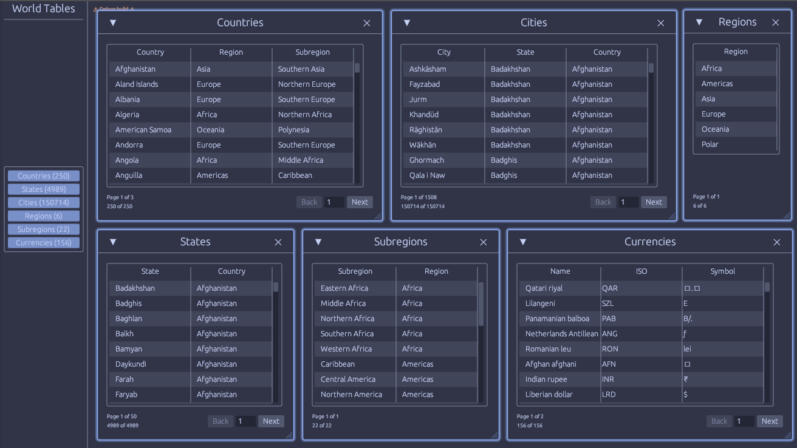
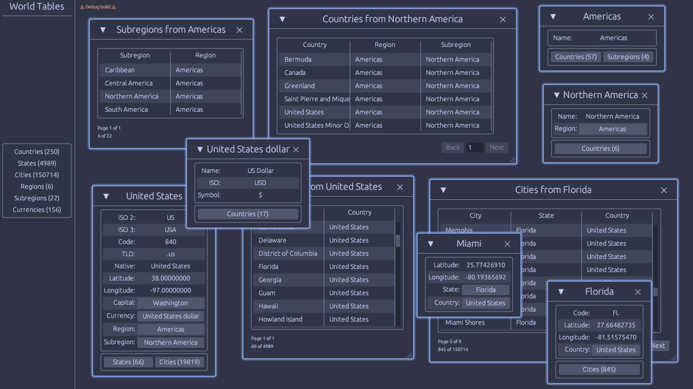

# World Tables

This was an experiment to implement an Egui interface with an API built using
Axum, making them work together as if the two were a single application.
Although currently limited to single-user use, this project was made thinking
about future, multi-user applications.

## Screenshots





## Notes

- This was only tested on Linux so far.

- I didn't want the Egui app to block when sending requests and waiting for the
API but I saw no reason to use `tokio` as in this case you are limited anyway
to the speed of button clicks from the user. I just used plain `std::thread` to
create threads that handle the requests and communicate back to the main thread
through channels.

- Since I'm using threads I don't know if the app works on wasm. It might just
work using `wasm_thread` and `reqwasm`.

- Using Sqlite with rust (`rusqlite`) and the best approach of using it with
either multi-threading or asynchronous programming seems to be a matter of
debate among people, with no clear consensus or documentation on the best
approach. I decided to just use a pool manager with `r2d2` but in this test I'm
still not properly using `tokio::spawn_blocking`. As a result, database calls
within the API's async handlers are still blocking, which is not a big deal for
this app.

- I didn't want to use a complicated ORM setup for the database so I have more
control over the queries and experiment later on. Instead, a set of simple
helper traits were made to still organize the code as if I was using an ORM,
and I split that up to the `dbent` library.

## Usage

If you just want to run the app, you need to install the 3 executables with
cargo, running the following command:

```sh
cargo install world-tables-data world-tables-server world-tables-gui
```

Then run the server:
```sh
world-tables-server
```

For building with this repository you need cargo-make. To install cargo-make,
run the following command:

```sh
cargo install cargo-make
```

Once installed, you can build the server and all other components by running:

```sh
cargo make server
```

Please note that running the server will also run the GUI application if
successful. The first time you run the server, the SQLite database will be
created in a user directory using the data app, which may take some time to
finish.

## Resources

* [Countries-States-Cities
  Database](https://github.com/dr5hn/countries-states-cities-database) - Data
  source with extra processing to create additional tables and relationships.

* [Catppuccin/egui](https://github.com/catppuccin/egui) - The cool Frappé theme
  for egui with a few personal customizations.

## License

Licensed under either of [Apache License, Version 2.0](LICENSE-APACHE) or
[MIT License](LICENSE-MIT) at your option.

Unless you explicitly state otherwise, any contribution intentionally submitted
for inclusion in World-Tables by you, as defined in the Apache-2.0 license,
shall be dual licensed as above, without any additional terms or conditions.

